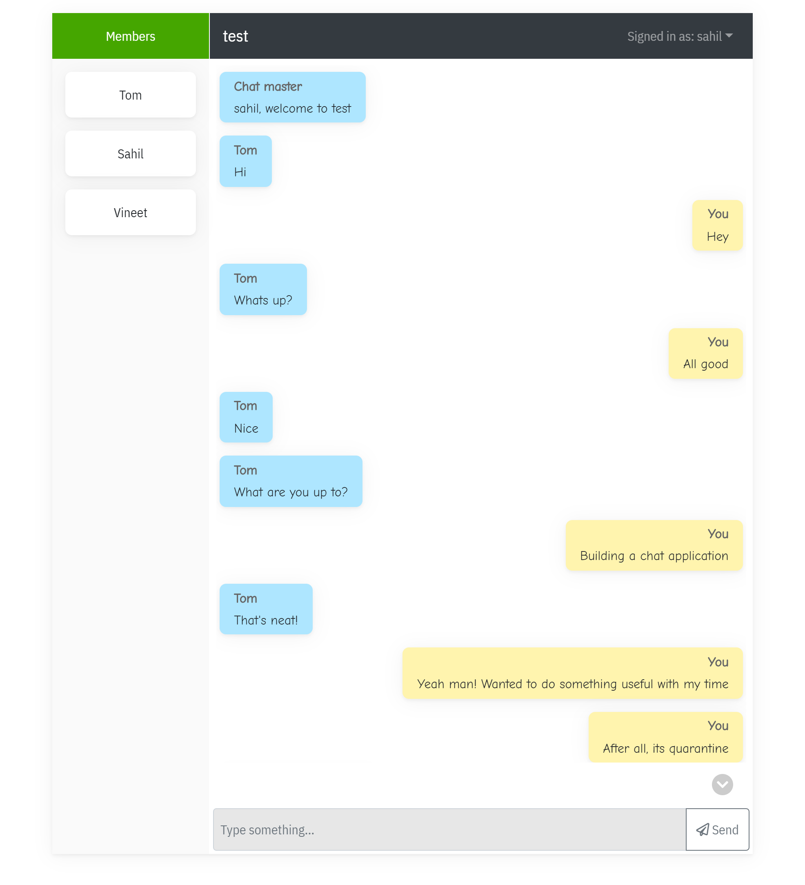

# messenger-app

A simple messenger app built using [socket-io](https://socket.io/) library.

#### Tech-stack:

- React.js [Client]
- Node.js [Server]
- Typescript [Server]

#### To run the application:

- Client: `yarn run start`
- Server: `yarn run start:server`
- Run client and server together: `yarn run start:all`

#### Want to contribute?

- Clone the repo using the command: `git clone https://github.com/sahiljohari/messenger-app.git`
- Run `yarn` to sync with all the dependencies
- Develop some awesome features for this app
- Create pull requests against `develop` branch
- Add appropriate description, steps for review, and labels to your pull request

**Note**: Any pull request made against `master` branch will be rejected automatically.

#### Inspiration

[Realtime Chat Application by Adrian Hajdin](https://github.com/adrianhajdin/project_chat_application)
