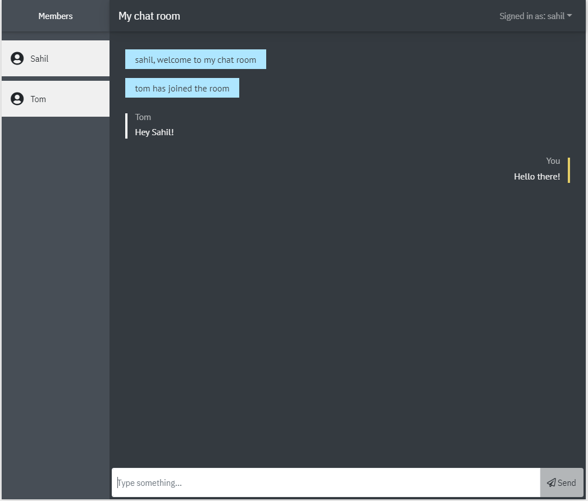

# messenger-app

#### To run the application:

Client:

- cd client
- npm run start

Server:

- cd server
- npm run start

To-do

- [x] Add an Info bar at the top of chat container
- [x] Style the input text field
- [x] Implement scroll-to-bottom feature
- [ ] Implement "typing..." feature
- [x] Redesign Login and LogOut component
- [x] Create a wrapper around server code
- [ ] Replace `npm` with `yarn`
- [x] Error handling in Server
- [ ] Convert client and server to TypeScript
- [ ] Implement Online indicator feature
